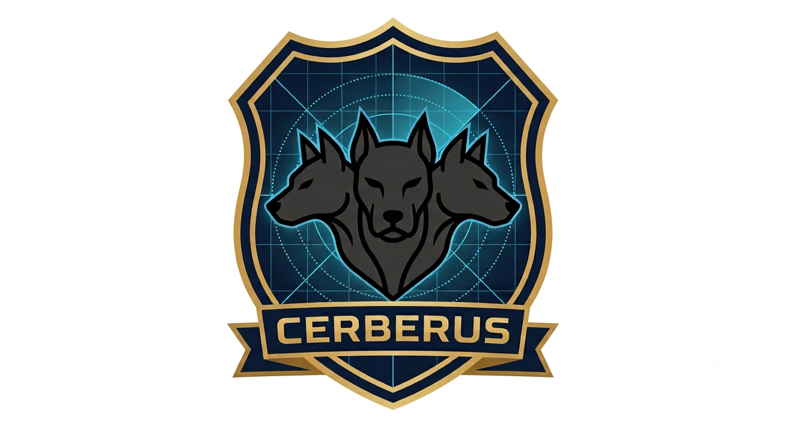

<p align="center">
  
</p>

# Cerberus

Plataforma corporativa de **monitoramento posicional contínuo** e **comunicações operacionais táticas**,
idealizada pelo Núcleo de Tecnologia da Informação de Minas Gerais (NTI/MG) para demandas de missão
crítica da Polícia Federal: cumprimento de mandados de busca e apreensão, proteção de dignitários em
grandes eventos e escolta de comboios.

A arquitetura (alusão ao cão mitológico de três cabeças) unifica três camadas sobre uma malha vetorial
de geolocalização:

| Módulo | Camada | Stack |
| --- | --- | --- |
| **API de Serviços** (Servidor Central) | API de Orquestração | Node.js + **Fastify** + TypeScript |
| **Aplicação Móvel de Campo** (Agentes) | Aplicação do Agente | **React Native** (Expo) |
| **Dashboard de Controle** (Administração Central) | Console de Comando | **Next.js** / React |

Apoiadas por: barramento **MQTT** (tempo real), **MongoDB** (índices geoespaciais `2dsphere`) e
arquitetura **Zero Trust** (multitenant por `operation_id`, JWT, ACL de tópicos, TLS 1.3, E2EE AES-256).

---

## Estrutura do monorepo

```
Cerberus/
├─ packages/shared/     # contratos: tipos, zod schemas, taxonomia de tópicos MQTT
├─ apps/api/            # Fastify — Servidor Central + ponte MQTT->Mongo
├─ apps/dashboard/      # Next.js — plotagem em tempo real (MQTT sobre WSS)
├─ apps/mobile/         # Expo — telemetria de GPS em background
├─ infra/               # configs de infraestrutura (mosquitto, etc.)
└─ docs/                # documentação técnica
```

> `apps/api` e `apps/dashboard` são workspaces npm. `apps/mobile` (Expo) roda como projeto próprio
> por conta das particularidades do Metro bundler com hoisting.

## Pré-requisitos

- Node.js >= 20
- Docker (para MongoDB + Mosquitto locais)

## Começando (ambiente de desenvolvimento — custo zero)

```bash
# 1. Instalar dependências (workspaces)
npm install

# 2. Configurar variáveis de ambiente
cp .env.example .env

# 3. Subir infraestrutura local (MongoDB + Mosquitto com listener WebSocket)
npm run infra:up

# 4. Compilar o pacote de contratos compartilhado
npm run shared:build

# 5. Semear um admin, uma operação e um agente de teste
npm run api:seed

# 6. Rodar API + Dashboard
npm run dev
```

- API: <http://localhost:3000> (`/health`)
- Dashboard: <http://localhost:3001>

O app móvel (`apps/mobile`) exige um **Expo Dev Client** por usar o módulo nativo
`react-native-background-geolocation`. Veja [apps/mobile/README.md](apps/mobile/README.md).

## Verificação rápida da fatia vertical (agente → mapa ao vivo)

Sem o celular em mãos, simule um agente publicando posições via MQTT:

```bash
npm run api:seed          # imprime OPERATION_ID e AGENT_ID de teste
# publique uma posição (mosquitto_pub ou o script utilitário):
node apps/api/scripts/publish-fake-position.mjs
```

Abra a operação no dashboard (`/operations/<id>/live`) e veja o marcador aparecer/mover em tempo real.

## Roadmap

Ver [docs/](docs/) e o plano de implementação. Entrega em fatias verticais:
Fase 0 fundações → Fase 1 telemetria E2E → Fase 2 auth/multitenant → Fase 3 comunicações/mídia →
Fase 4 telemetria avançada/geofencing → Fase 5 E2EE → Fase 6 hardening & deploy DTI.
